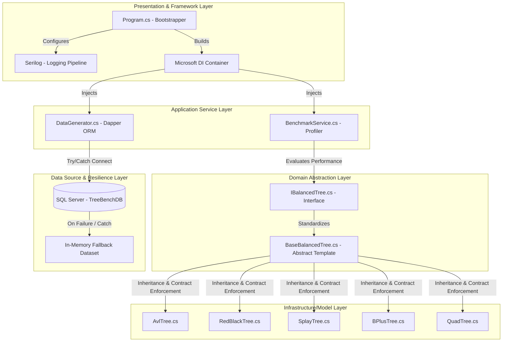
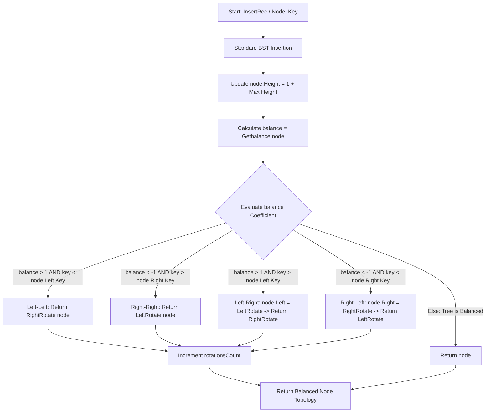
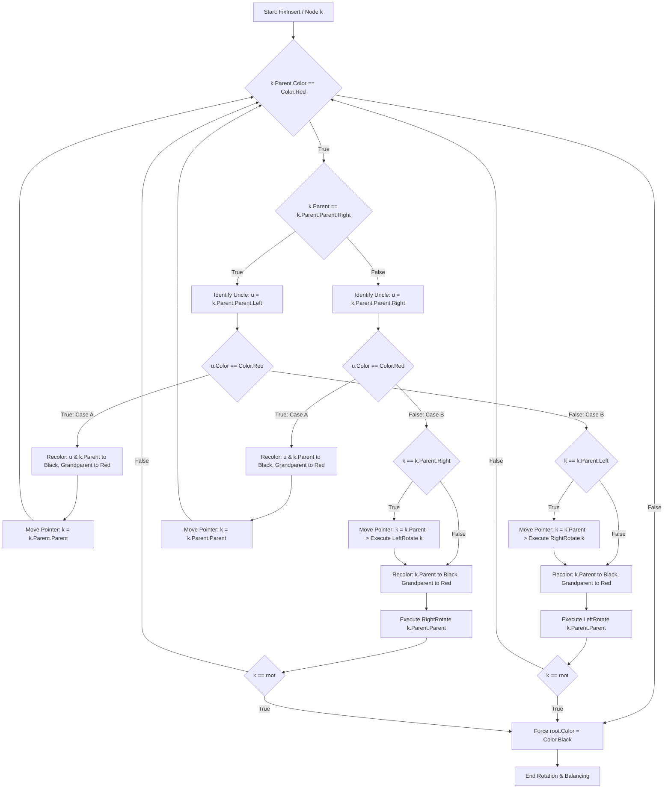
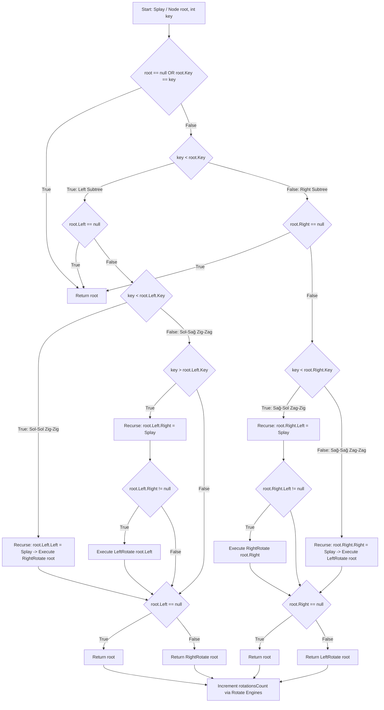

# TreeBench v2.0 - Advanced Data Structures Performance Lab


---

TreeBench is an advanced, enterprise-grade benchmarking laboratory designed to analyze, profile, and contrast self-balancing binary search trees, multi-way indexes, and spatial data structures (**AVL Tree, Red-Black Tree, Splay Tree, B+ Tree, and Quadtree**). 

The architecture streams **100,000 live records from a Microsoft SQL Server** directly into volatile C# memory via low-level Dapper pipelines. If the database engine is offline, a robust **In-Memory Fallback Mechanism** seamlessly initializes a mock production dataset to ensure zero telemetry distortion during execution.

---

## 📂 Project Directory Structure

Below is the enterprise layout of the solution, exhibiting a clean Separation of Concerns (SoC) and Abstract Template patterns:

```text
📂 TreeBench/
│
├── 📂 TreeBench.DB/
│   └── 📂 T-SQL/
│       └── TreeBenchDB.sql          # SQL Script for database initialization
│
└── 📂 TreeBench.BS/
    ├── 📂 Interfaces/
    │   └── IBalancedTree.cs         # Domain abstraction contract (The Blueprint)
    │
    ├── 📂 Models/
    │   ├── BaseBalancedTree.cs      # Abstract Template Class for structural standardization
    │   ├── AvlTree.cs               # AVL Tree implementation (Height-Balanced)
    │   ├── RedBlackTree.cs          # Red-Black Tree implementation (Color-Balanced)
    │   ├── SplayTree.cs             # Splay Tree implementation (Locality Optimized)
    │   ├── BPlusTree.cs             # B+ Tree implementation (Multi-way Database Index)
    │   └── QuadTree.cs              # Quadtree implementation (Spatial 2D Coordinate Index)
    │
    ├── 📂 Services/
    │   ├── BenchmarkService.cs      # Telemetry Profiler Engine with Deletion Stress Testing
    │   └── DataGenerator.cs         # Micro-ORM Dapper Data Ingestion Streamer
    │
    ├── TreeBench.BS.csproj          # .NET Project Configuration File with NuGet Manifests
    └── Program.cs                   # IoC Container Registry, App Bootstrapper & Serilog Configuration
```

## 🏗️ Architectural Principles Applied

The project strictly follows SOLID design principles, combining Inversion of Control (IoC) and Template Method Patterns to isolate runtime pipelines.



* **Interface Segregation & Template Abstraction (BaseBalancedTree):** Enforces a rigid template method for search and deletion hooks, ensuring global edge-case checks (e.g., empty tree detection) are executed uniformly across all topologies before invoking concrete algorithmic engines (SearchInternal / DeleteInternal).
* **Dependency Injection & Loose Coupling:** All operational dependencies are registered inside an asynchronous service collection and resolved via Microsoft.Extensions.DependencyInjection, avoiding hardcoded allocations.
* **Graceful Degradation / Resilience:** Features an automatic runtime check during veritabanı ingestion. If a connection fault occurs, the pipeline catches the anomaly and populates a 100,000 record fallback dataset dynamically without delaying or prompting the main execution thread.

---

## 🔬 Monitored Metrics & Low-Level Profiling

The lab captures real-time telemetry backed by structural validation parameters:

* **Insert Duration:** Tracks the exact CPU clock cycles taken to construct and structure 100,000 entries using System.Diagnostics.Stopwatch.
* **Search Telemetry:** Runs 10,000 randomized lookups to compute index navigation speed.
* **Deletion Stress Testing:** Executes 5,000 concrete sequential removals to evaluate balancing and restructuring penalties.
* **Total Rotations & Structural Mutations:** Tracks balancing operations, color changes, page splits, and quadrant divisions.
* **Structured Logging & Telemetry Reporting:** Managed by Serilog; records telemetry indicators simultaneously to the console with precise formatting and a persistent filesystem sink (logs/treebench_perf.txt).

---

## 💻 Technical Implementations & Tree Mechanics
### 📊 Technical Flowcharts & Execution Vectors (Click to Expand)

### 1. AVL Tree (`AvlTree.cs`)

* Strict height-balancing regime where height differences cannot exceed 1.
* Employs reactive single and double rotations (**Left-Right / Right-Left Double Rotations**) immediately during recursive unwinding.


<details>
<summary><b>📐 1. AVL Tree (AvlTree.cs) - Balancing Logic</b></summary>



</details>

### 2. Red-Black Tree (`RedBlackTree.cs`)

* Node-based structural color balancing mapping pointer properties to `Color.Red` and `Color.Black`.
* Implements a persistent **Sentinel Node (`TNULL`)** architecture to minimize memory reference errors.
* Leverages iterative pointer tracing up to the **Uncle** and **Grandparent** nodes inside an iterative repair loop (`FixInsert`).


<details>
<summary><b>📐 2. RBT Tree (RedBlackTree.cs) - Balancing Logic</b></summary>
    


</details>

### 3. Splay Tree (`SplayTree.cs`)

* A self-adjusting search tree that dynamically optimizes around the **Locality of Reference** principle.

* Every operation triggers a recursive `Splay` mechanism, violently cascading the targeted key up to the root using custom **Zig-Zig** and **Zig-Zag** double rotation vectors.


<details>

<summary><b>📐 3. SplayTree Tree (SplayTree.cs) - Balancing Logic</b></summary>

    



</details>

### 4. B+ Tree ('BPlusTree.cs')

* An $m$-way balanced search tree designed explicitly for database structural indexing loops.
* Restricts records strictly inside the external leaves while internal pages hold directory values, executing automated Split-Child mutations on saturation boundaries.

<details>

<summary><b>📐 3. SplayTree Tree (SplayTree.cs) - Balancing Logic</b></summary>

```mermaid

```

</details>


### 5. Quadtree ('QuadTree.cs')
* A spatial partitioning tree structure optimizing two-dimensional grid lookups.
* Maps numerical keys to structural Point('X, Y') planes, dividing geographical space recursively into four quadrants ('NorthWest, NorthEast, SouthWest, SouthEast') when node capacities are reached.

<details>
<summary><b>📐 3. SplayTree Tree (SplayTree.cs) - Balancing Logic</b></summary>

```mermaid

```
---

</details>

## 🚀 Installation & Getting Started

### Prerequisites
*  [.NET SDK](https://dotnet.microsoft.com/download) (Version 6.0 or higher recommended)
* Microsoft SQL Server (LocalDB or SQLEXPRESS)


### 1. Repository Cloning
Clone the project architecture to your localized workstation using Git:

```bash
git clone https://github.com/EgeSul/TreeBench.BR
cd TreeBench.BR
```


### 2. Database Provisioning
Run the following script inside SQL Server Management Studio (SSMS) to instantiate the database pipeline:

```sql

CREATE DATABASE TreeBenchDB;
GO

USE TreeBenchDB;
GO

CREATE TABLE TestNumbers (
    ID INT IDENTITY(1,1) PRIMARY KEY,
    Value INT NOT NULL,
    DataType VARCHAR(20) NOT NULL
);
GO


-- Populate with 100,000 random records for mock testing
SET NOCOUNT ON;
DECLARE @i INT = 1;
WHILE @i <= 100000
BEGIN
    INSERT INTO TestNumbers (Value, DataType)
    VALUES (CAST(RAND() * 1000000 AS INT), 'Production');
    SET @i = @i + 1;
END;
GO

```

### 2. Configure Connection String
Open Services/DataGenerator.cs and configure your localized SQL Server connection string properties:
```C#
Open Services/DataGenerator.cs and configure your localized SQL Server connection string properties:
```
### 3. Run Benchmark Compilation
Execute the following native commands in your terminal or compile directly via Visual Studio:

```Bash
dotnet build
dotnet run --configuration Release
```


### Future Releases / Roadmap:

<br>[x] v1.0.0 - AVL & Red-Black Tree benchmarking with advanced memory profiling.
<br>[X] v1.5.0 - .NET Dependency Injection
<br>[ ] v2.0.0 - Transitioning to multi-way structures (B+ Tree) and spatial indexing (Quadtree) for enterprise data simulation.

---

### 📄 License
This architecture is completely open-source and released under the MIT License. 

