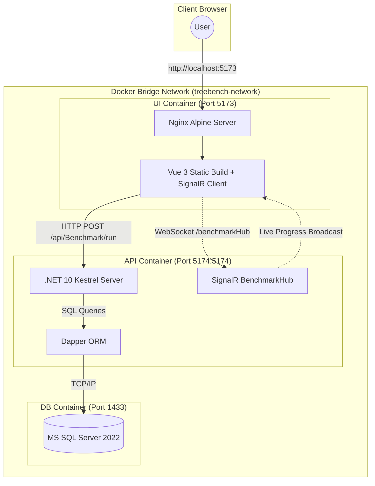
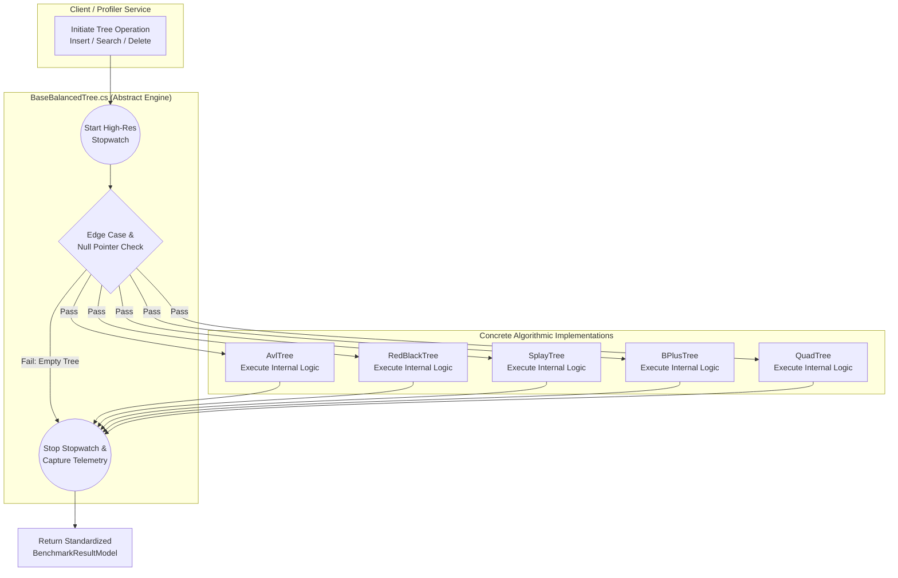
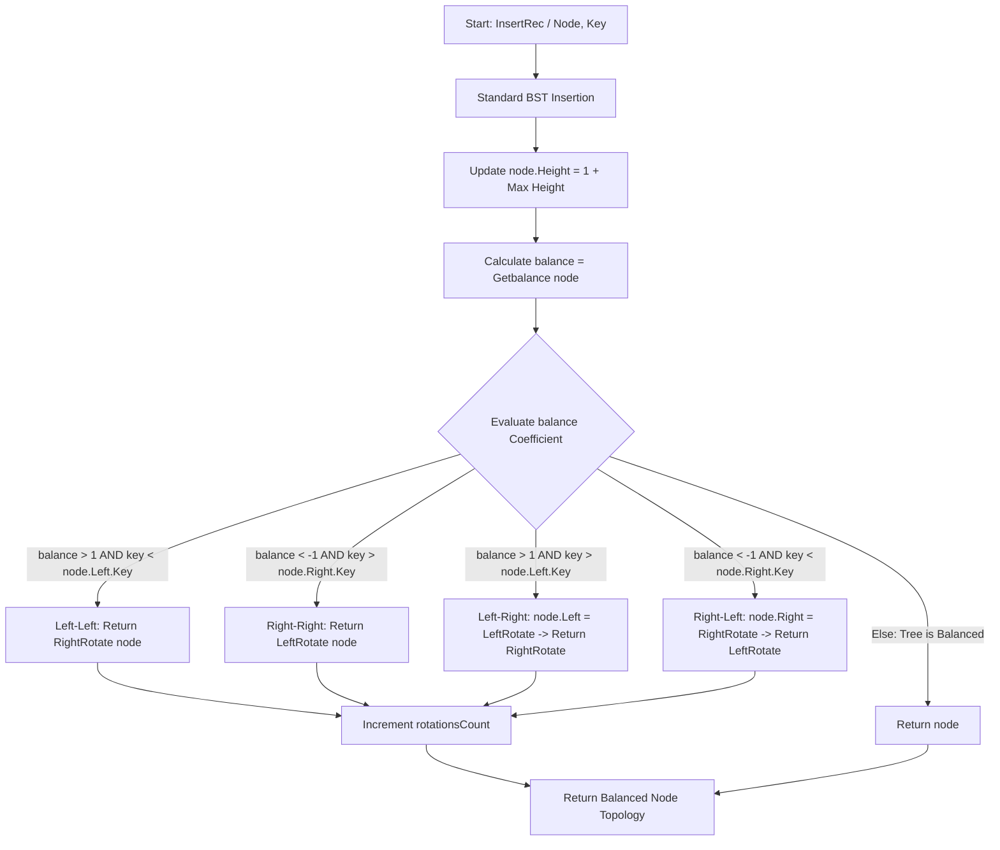
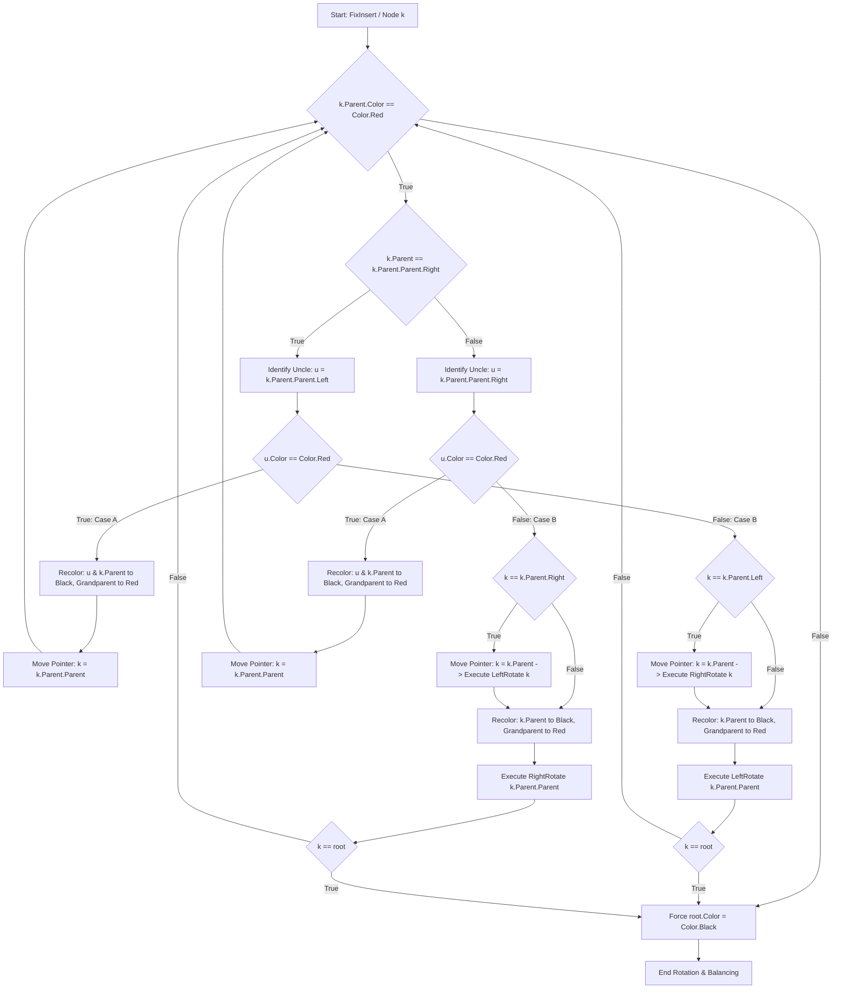
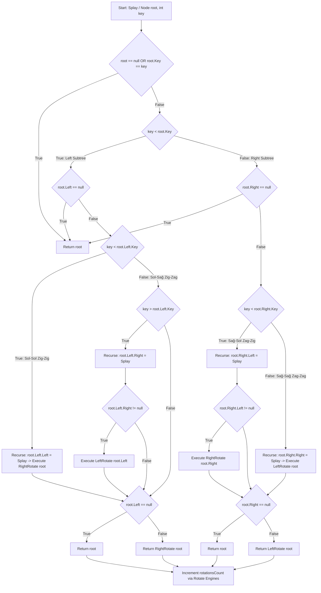
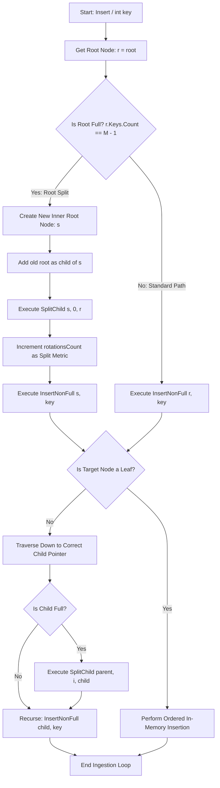

# TreeBench v4.0.0 - Enterprise Full-Stack Data Structures Performance Lab


---

TreeBench is an advanced, enterprise-grade benchmarking laboratory designed to analyze, profile, and contrast self-balancing binary search trees, multi-way indexes, and spatial data structures (**AVL Tree, Red-Black Tree, Splay Tree, B+ Tree, and Quadtree**).

Transitioning from a console-based profiler to a **Fully Dockerized Full-Stack Application with Real-Time Capabilities**, TreeBench now features a robust ASP.NET Core 10 Web API backend empowered by **SignalR WebSockets** for live progress tracking, an isolated SQL Server 2022 container, a comprehensive **xUnit & Moq automated testing suite**, and a highly responsive cyberpunk-themed Vue 3 (Vite) Single Page Application (SPA).

The architecture streams 100,000 live records from the SQL Server directly into volatile C# memory via low-level Dapper pipelines, pushing telemetry and execution progress in real-time to a rich graphical dashboard powered by ApexCharts. If the database engine is empty or offline, a robust **In-Memory Fallback Mechanism** seamlessly initializes a mock production dataset to ensure zero telemetry distortion.

---

## 🛠️ Tech Stack & Packages Used

### Backend & API (.NET 10)
* **ASP.NET Core Web API**: Main RESTful framework.
* **SignalR**: Real-time bidirectional communication hub for live telemetry streaming.
* **Dapper**: High-performance Micro-ORM for raw SQL execution.
* **Microsoft.Data.SqlClient**: Modern, cross-platform SQL Server driver (Linux/Docker compatible).
* **Serilog**: Structured diagnostic logging.
* **Swashbuckle.AspNetCore (Swagger)**: API documentation and endpoint testing.

### Testing Suite
* **xUnit**: Industry-standard unit testing framework for .NET.
* **Moq**: Popular mocking library for isolated component validation.

### Frontend & UI (Vue 3)
* **Vue 3 (Composition API)**: Core frontend framework.
* **Vite**: Next-generation frontend tooling and bundler.
* **Microsoft SignalR Client (`@microsoft/signalr`)**: Real-time websocket subscription layer.
* **ApexCharts (vue3-apexcharts)**: Interactive and responsive telemetry visualization.
* **FontAwesome**: Scalable vector icons.

### DevOps & Infrastructure
* **Docker**: Containerization of the ecosystem.
* **Docker Compose**: Multi-container orchestration (`db`, `api`, `ui`).
* **Nginx (Alpine)**: Lightweight, high-performance web server serving the Vue SPA.

---

## 📂 Enterprise Directory Structure

Below is the updated layout of the solution, exhibiting a clean Separation of Concerns (SoC) across the full-stack dockerized environment:

```text
📂 TreeBench/
│
├── 🐳 docker-compose.yml            # Multi-container orchestration (SQL, API, Nginx)
├── 📂 TreeBench.API/                # ASP.NET Core Web API Presentation Layer
│   ├── 🐳 Dockerfile                # .NET 10 Build & Runtime definitions
│   ├── Controllers/                 # RESTful Endpoints (BenchmarkController)
│   ├── Hubs/                        # Real-time SignalR Hubs (BenchmarkHub.cs)
│   └── Program.cs                   # IoC Registry, CORS, SignalR & Serilog Bootstrapper
│
├── 📂 TreeBench.UI/                 # Enterprise Vue 3 Frontend (Vite)
│   ├── 🐳 Dockerfile                # Node.js Build -> Nginx Alpine Serve
│   ├── 📂 src/
│   │   ├── App.vue                  # Main Dashboard (SignalR Client, Dark/Light Mode, i18n)
│   │   └── main.js                  # Vue Application & ApexCharts Initialization
│   └── vite.config.js               # Vite Proxy Configuration
│
├── 📂 TreeBench.DB/                 # Database Assets
│   └── T-SQL/TreeBenchDB.sql        # SQL Script for table initialization
│
├── 📂 TreeBench.Tests/              # Automated Unit Testing Suite
│   └── UnitTest1.cs                 # xUnit & Moq validation pipelines
│
└── 📂 TreeBench.BS/                 # Business Logic & Infrastructure
    ├── 📂 Interfaces/               # Domain abstraction contracts (IBalancedTree.cs)
    ├── 📂 Models/                   # Abstract Templates & Concrete Tree Implementations
    └── 📂 Services/                 # Telemetry Profiler & Dapper Data Ingestion
```

## 🏗️ Docker Architecture & Real-Time Data Flow

To maintain a production-grade ecosystem, TreeBench implements strict modularity. The entire system is spun up using Docker Compose, creating an isolated internal bridge network (treebench-network).


```mermaid

graph TD
    subgraph Browser ["Client Browser"]
        User((User))
    end

    subgraph DockerNetwork ["Docker Bridge Network (treebench-network)"]
        subgraph UIContainer ["UI Container (Port 5173)"]
            Nginx[Nginx Alpine Server]
            Vue[Vue 3 Static Build + SignalR Client]
        end

        subgraph APIContainer ["API Container (Port 5174:5174)"]
            NET[.NET 10 Kestrel Server]
            Hub[SignalR BenchmarkHub]
            Dapper[Dapper ORM]
        end

        subgraph DBContainer ["DB Container (Port 1433)"]
            SQL[(MS SQL Server 2022)]
        end
    end

    User -->|http://localhost:5173| Nginx
    Nginx --> Vue
    Vue -->|HTTP POST /api/Benchmark/run| NET
    Vue -.->|WebSocket /benchmarkHub| Hub
    NET -->|SQL Queries| Dapper
    Dapper -->|TCP/IP| SQL
    Hub -.->|Live Progress Broadcast| Vue
```

## 🌳 Models Tree Update (Template Method Refactoring)

In version 2.0+, the tree architecture underwent a massive refactoring process. Instead of individual trees handling their own edge cases, execution timers, and validation logic, the system enforces the Template Method Design Pattern via an abstract BaseBalancedTree class.

This guarantees that all performance metrics (Stopwatch operations) and null-reference safety checks are uniformly executed before reaching the specific algorithmic behaviors (InsertInternal, SearchInternal, DeleteInternal) of the concrete tree implementations.

### Algorithmic Execution Pipeline


```mermaid

graph TD
    subgraph ClientRequest ["Client / Profiler Service"]
        Req[Initiate Tree Operation <br> Insert / Search / Delete]
    end

    subgraph BaseClass ["BaseBalancedTree.cs (Abstract Engine)"]
        TimerStart((Start High-Res <br> Stopwatch))
        Validation{Edge Case & <br> Null Pointer Check}
        TimerStop((Stop Stopwatch & <br> Capture Telemetry))
    end

    subgraph ConcreteTrees ["Concrete Algorithmic Implementations"]
        AVL[AvlTree <br> Execute Internal Logic]
        RBT[RedBlackTree <br> Execute Internal Logic]
        Splay[SplayTree <br> Execute Internal Logic]
        BPlus[BPlusTree <br> Execute Internal Logic]
        Quad[QuadTree <br> Execute Internal Logic]
    end

    Req --> TimerStart
    TimerStart --> Validation
    
    Validation -->|Pass| AVL
    Validation -->|Pass| RBT
    Validation -->|Pass| Splay
    Validation -->|Pass| BPlus
    Validation -->|Pass| Quad
    
    Validation -->|Fail: Empty Tree| TimerStop

    AVL --> TimerStop
    RBT --> TimerStop
    Splay --> TimerStop
    BPlus --> TimerStop
    Quad --> TimerStop

    TimerStop --> Result[Return Standardized <br> BenchmarkResultModel]
```

## 💻 Technical Implementations & Tree Mechanics
### 📊 Technical Flowcharts & Execution Vectors (Click to Expand)
### 1. AVL Tree (AvlTree.cs)

*    Strict height-balancing regime where height differences cannot exceed 1.
*    Employs reactive single and double rotations (Left-Right / Right-Left Double Rotations) immediately during recursive unwinding.

<details>
<summary><b>📐 1. AVL Tree (AvlTree.cs) - Balancing Logic</b></summary>


```mermaid

graph TD
    A[Start: InsertRec / Node, Key] --> B[Standard BST Insertion]
    B --> C[Update node.Height = 1 + Max Height]
    C --> D[Calculate balance = Getbalance node]
    D --> E{Evaluate balance Coefficient}

    E -->|balance > 1 AND key < node.Left.Key| F[Left-Left: Return RightRotate node]
    E -->|balance < -1 AND key > node.Right.Key| G[Right-Right: Return LeftRotate node]
    E -->|balance > 1 AND key > node.Left.Key| H[Left-Right: node.Left = LeftRotate -> Return RightRotate]
    E -->|balance < -1 AND key < node.Right.Key| I[Right-Left: node.Right = RightRotate -> Return LeftRotate]
    E -->|Else: Tree is Balanced| J[Return node]
    
    F --> K[Increment rotationsCount]
    G --> K
    H --> K
    I --> K
    K --> L[Return Balanced Node Topology]
    J --> L
```

</details>

### 2. Red-Black Tree (RedBlackTree.cs)

*    Node-based structural color balancing mapping pointer properties to Color.Red and Color.Black.
*    Implements a persistent Sentinel Node (TNULL) architecture to minimize memory reference errors.
*    Leverages iterative pointer tracing up to the Uncle and Grandparent nodes inside an iterative repair loop (FixInsert).

<details>
<summary><b>📐 2. RBT Tree (RedBlackTree.cs) - Balancing Logic</b></summary>
    

```mermaid

graph TD
    A[Start: FixInsert / Node k] --> B{k.Parent.Color == Color.Red}
    B -->|False| C[Force root.Color = Color.Black]
    C --> D[End Rotation & Balancing]

    B -->|True| E{k.Parent == k.Parent.Parent.Right}

    %% RIGHT SIDE UNCLE LOGIC
    E -->|True| F[Identify Uncle: u = k.Parent.Parent.Left]
    F --> G{u.Color == Color.Red}
    G -->|True: Case A| H[Recolor: u & k.Parent to Black, Grandparent to Red]
    H --> H2[Move Pointer: k = k.Parent.Parent]
    H2 --> B

    G -->|False: Case B| I{k == k.Parent.Left}
    I -->|True| J[Move Pointer: k = k.Parent -> Execute RightRotate k]
    I -->|False| K[Recolor: k.Parent to Black, Grandparent to Red]
    J --> K
    K --> L[Execute LeftRotate k.Parent.Parent]
    L --> M{k == root}
    M -->|True| C
    M -->|False| B

    %% LEFT SIDE UNCLE LOGIC
    E -->|False| N[Identify Uncle: u = k.Parent.Parent.Right]
    N --> O{u.Color == Color.Red}
    O -->|True: Case A| P[Recolor: u & k.Parent to Black, Grandparent to Red]
    P --> P2[Move Pointer: k = k.Parent.Parent]
    P2 --> B

    O -->|False: Case B| Q{k == k.Parent.Right}
    Q -->|True| R[Move Pointer: k = k.Parent -> Execute LeftRotate k]
    Q -->|False| S[Recolor: k.Parent to Black, Grandparent to Red]
    R --> S
    S --> T[Execute RightRotate k.Parent.Parent]
    T --> U{k == root}
    U -->|True| C
    U -->|False| B
```

</details>

### 3. Splay Tree (SplayTree.cs)

*    A self-adjusting search tree that dynamically optimizes around the Locality of Reference principle.
*    Every operation triggers a recursive Splay mechanism, violently cascading the targeted key up to the root using custom Zig-Zig and Zig-Zag double rotation vectors.

<details>

<summary><b>📐 3. SplayTree Tree (SplayTree.cs) - Balancing Logic</b></summary>


```mermaid

graph TD
    A[Start: Splay / Node root, int key] --> B{root == null OR root.Key == key}
    B -->|True| C[Return root]
    
    B -->|False| D{key < root.Key}
    
    %% LEFT SUBTREE SPLAYING
    D -->|True: Left Subtree| E{root.Left == null}
    E -->|True| C
    E -->|False| F{key < root.Left.Key}
    F -->|True: Sol-Sol Zig-Zig| G[Recurse: root.Left.Left = Splay -> Execute RightRotate root]
    F -->|False: Sol-Sağ Zig-Zag| H{key > root.Left.Key}
    H -->|True| I[Recurse: root.Left.Right = Splay]
    I --> J{root.Left.Right != null}
    J -->|True| K[Execute LeftRotate root.Left]
    J -->|False| L{root.Left == null}
    K --> L
    G --> L
    H -->|False| L
    L -->|True| M[Return root]
    L -->|False| N[Return RightRotate root]
    
    %% RIGHT SUBTREE SPLAYING
    D -->|False: Right Subtree| O{root.Right == null}
    O -->|True| C
    O -->|False| P{key < root.Right.Key}
    P -->|True: Sağ-Sol Zag-Zig| Q[Recurse: root.Right.Left = Splay]
    Q --> R{root.Right.Left != null}
    R -->|True| S[Execute RightRotate root.Right]
    R --> T{root.Right == null}
    S --> T
    P -->|False: Sağ-Sağ Zag-Zag| U[Recurse: root.Right.Right = Splay -> Execute LeftRotate root]
    U --> T
    T -->|True| V[Return root]
    T -->|False| W[Return LeftRotate root]

    M --> X[Increment rotationsCount via Rotate Engines]
    N --> X
    V --> X
    W --> X
```

</details>


### 4. B+ Tree (BPlusTree.cs)

*    An m-way balanced search tree designed explicitly for database structural indexing loops.
*    Restricts records strictly inside the external leaves while internal pages hold directory values, executing automated Split-Child mutations on saturation boundaries.


<details>
<summary><b>📐 4. B+ Tree (`BPlusTree.cs`) - Splitting & Ingestion Pipeline</b></summary>


```mermaid

graph TD
    A[Start: Insert / int key] --> B[Get Root Node: r = root]
    B --> C{Is Root Full? r.Keys.Count == M - 1}
    
    C -->|Yes: Root Split| D[Create New Inner Root Node: s]
    D --> E[Add old root as child of s]
    E --> F[Execute SplitChild s, 0, r]
    F --> G[Increment rotationsCount as Split Metric]
    G --> H[Execute InsertNonFull s, key]
    
    C -->|No: Standard Path| I[Execute InsertNonFull r, key]
    
    H --> J{Is Target Node a Leaf?}
    I --> J
    
    J -->|Yes| K[Perform Ordered In-Memory Insertion]
    J -->|No| L[Traverse Down to Correct Child Pointer]
    L --> M{Is Child Full?}
    M -->|Yes| N[Execute SplitChild parent, i, child]
    M -->|No| O[Recurse: InsertNonFull child, key]
    N --> O
    O --> P[End Ingestion Loop]
    K --> P
```

</details>

### 5. Quadtree (QuadTree.cs)

*    Maps single-dimensional integers into absolute Point(X, Y) planes to mock geographical queries.
*    Executes atomic Subdivide splits to break down dense areas into 4 distinct child vectors.
*    Maps numerical keys to structural Point(X, Y) planes, dividing geographical space recursively into four quadrants (NorthWest, NorthEast, SouthWest, SouthEast) when node capacities are reached.

<details>
<summary><b>📐 5. Quadtree ('QuadTree.cs') - Balancing Logic</b></summary>

  ```mermaid

graph TD
    A[Start: Insert / int key] --> B[Map Key to Coordinates: X = key % 1000, Y = key / 1000]
    B --> C[Create Point Interface Instance: p]
    C --> D[Invoke InsertInternal root, p]
    D --> E{Does Node Boundary Contain Point?}
    
    E -->|False| F[Return false - Anomaly Isolated]
    E -->|True| G{Node.Points.Count < CAPACITY AND !IsDivided}
    
    G -->|True: Safe Ingestion| H[Push Point into Node.Points Collection]
    G -->|False: Limit Exceeded| I{Is Node Already Subdivided?}
    
    I -->|No| J[Execute Subdivide node]
    J --> K[Instantiate NorthWest, NorthEast, SouthWest, SouthEast Nodes]
    K --> L[Clear Node Points & Redistribute to 4 Quadrants]
    L --> M[Increment rotationsCount as Divide Metric]
    M --> N[Forward Traversal to Children Nodes]
    I -->|Yes| N
    
    N --> O[Recursively invoke InsertInternal on Sub-Quadrants]
    O --> P[Return true -> Increment global count]
    H --> P
```

</details>

---

## 📦 Installed NuGet Packages & System Dependencies

The solution leverages industry-standard corporate packages to drive data mapping, dependency tracking, and rolling diagnostics. Below is the package manifest configured inside `TreeBench.BS.csproj`:

| Package Name | Minimum Version | Core Utility within Architecture |
| :--- | :---: | :--- |
| **`Microsoft.Data.SqlClient`** | `5.0.0+` | Provides high-performance native ADO.NET pipe connection streams to Microsoft SQL Server instances. |
| **`Microsoft.Extensions.DependencyInjection`** | `6.0.0+` | Framework-native Inversion of Control (IoC) container engine used to decouple concrete structural model instances from execution triggers. |
| **`Dapper`** | `2.0.0+` | Blazing-fast micro-ORM utilized to automate raw T-SQL dataset query result mapping straight into volatile C# generic lists without metadata overhead. |
| **`Serilog`** | `3.0.0+` | Core diagnostic router driving asynchronous structured logging parameters instead of thread-blocking standard outputs. |
| **`Serilog.Sinks.Console`** | `5.0.0+` | Render sink for Serilog to print stylized, color-coded execution telemetry intervals directly into the active console pipeline. |
| **`Serilog.Sinks.File`** | `5.0.0+` | Persistent storage sink routing structured execution history lines down onto local rolling text files (`logs/treebench_perf.txt`). |

To manually restore and sync all architectural project dependencies on a fresh deployment station, execute:

```bash

dotnet restore

```

## 🚀 Installation & Getting Started (Docker Mode)

Forget manual dependency setups. You only need Docker Desktop installed on your machine.
### 1. Fire up the Ecosystem

Open a terminal in the root directory (where docker-compose.yml is located) and run:
    
    docker compose up -d --build

This command will pull the SQL Server, build the .NET 10 API, compile the Vue 3 application, and wire them all together in an isolated network.

### 2. Seed the Database

Connect to the Dockerized SQL Server via SQL Server Management Studio (SSMS) or Azure Data Studio:

*    Server Name: localhost,1433
*    Authentication: SQL Server Authentication
*    Login: sa
*    Password: TreeBench_StrongPass123!

Open a New Query and run the provided SQL script to seed 100,000 records:

```SQL
SQL

CREATE DATABASE TreeBenchDB;
GO
USE TreeBenchDB;
GO
CREATE TABLE TestNumbers (
    ID INT IDENTITY(1,1) PRIMARY KEY,
    Value INT NOT NULL,
    DataType VARCHAR(20) NOT NULL
);
GO
SET NOCOUNT ON;
DECLARE @i INT = 1;
WHILE @i <= 100000
BEGIN
    INSERT INTO TestNumbers (Value, DataType) VALUES (CAST(RAND() * 1000000 AS INT), 'Production');
    SET @i = @i + 1;
END;
GO
```
(Note: If you skip this step, the API's Fault Tolerance mechanism will auto-generate an in-memory dataset without crashing!)

### 3. Launch the Dashboard

Open your browser and navigate to:

    👉 http://localhost:5173

Click the "Run Benchmark" button to watch the real-time SignalR progress bar stream telemetry and render the comprehensive ApexCharts performance analytics.

## 🗺️ Development Roadmap

    [x] v1.0.0 - AVL & Red-Black Tree benchmarking with advanced memory profiling.

    [x] v1.5.0 - .NET Dependency Injection & Dapper micro-ORM integration.

    [x] v2.0.0 - Abstract Template Engine refactoring, Fallback architecture, Serilog structure.

    [x] v2.5.0 - ASP.NET Web API integration, Vue 3 SPA frontend with ApexCharts, CORS tunneling.

    [x] v3.0.0 - Complete Full-Stack Dockerization (Nginx, .NET 10, SQL Server 2022) with custom network mapping.

    [x] v4.0.0 - SignalR real-time telemetry streaming, xUnit & Moq automated testing suite, and advanced robust error handling.,

## 📄 License & Architecture

This architecture is completely open-source and released under the MIT License. Designed and engineered for high-performance enterprise benchmarking analysis.
