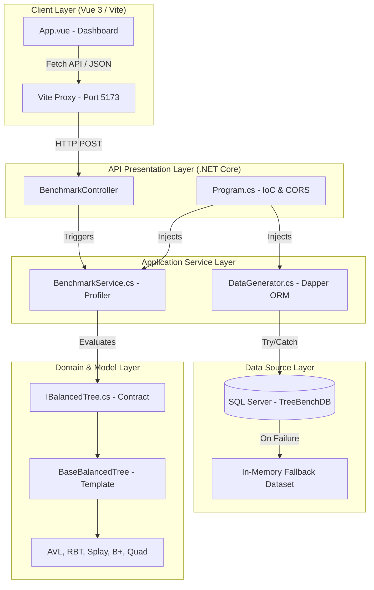

# TreeBench v2.5 - Advanced Full-Stack Data Structures Performance Lab


---

TreeBench is an advanced, enterprise-grade benchmarking laboratory designed to analyze, profile, and contrast self-balancing binary search trees, multi-way indexes, and spatial data structures (AVL Tree, Red-Black Tree, Splay Tree, B+ Tree, and Quadtree).

Transitioning from a console-based profiler to a Full-Stack Application, TreeBench now features a robust ASP.NET Core Web API backend and a highly responsive, cyberpunk-themed Vue 3 (Vite) Single Page Application (SPA).

The architecture streams 100,000 live records from a Microsoft SQL Server directly into volatile C# memory via low-level Dapper pipelines, pushing the results to a rich graphical dashboard powered by ApexCharts. If the database engine is offline, a robust In-Memory Fallback Mechanism seamlessly initializes a mock production dataset to ensure zero telemetry distortion.

---

## 📂 Enterprise Directory Structure

Below is the updated layout of the solution, exhibiting a clean Separation of Concerns (SoC) across the full-stack environment:
Plaintext


```text
📂 TreeBench/
│
├── 📂 README.md
│
├── 📂 TreeBench.API/                # ASP.NET Core Web API Presentation Layer
│   ├── Controllers/                 # RESTful Endpoints (BenchmarkController)
│   └── Program.cs                   # IoC Registry, CORS, and Serilog Bootstrapper
│
├── 📂 TreeBench.UI/                 # Enterprise Vue 3 Frontend (Vite)
│   ├── 📂 src/
│   │   ├── App.vue                  # Main Dashboard (Dark/Light Mode, i18n, AI Widget)
│   │   └── main.js                  # Vue Application & ApexCharts Initialization
│   └── vite.config.js               # Vite Proxy Configuration for seamless API communication
│
├── 📂 TreeBench.DB/                 # Database Assets
│   └── T-SQL/TreeBenchDB.sql        # SQL Script for table initialization
│
└── 📂 TreeBench.BS/                 # Business Logic & Infrastructure
    ├── 📂 Interfaces/               # Domain abstraction contracts (IBalancedTree.cs)
    ├── 📂 Models/                   # Abstract Templates & Concrete Tree Implementations
    └── 📂 Services/                 # Telemetry Profiler & Dapper Data Ingestion

```

---

## 🛠️ Architectural Breakdown (System Modularity & Purpose)

To maintain a production-grade ecosystem, TreeBench implements strict modularity from the database layer all the way to the browser:

### 1. Vue 3 SPA Presentation Layer (Frontend)

What: A reactive, responsive dashboard built with Vue 3, Vite, and ApexCharts.
Why: To visualize complex telemetry data (Insert/Search/Delete times, Traversals, RAM usage) instantly.
How It's Modular: It utilizes a strict Vite Proxy configuration to handle CORS seamlessly, dynamically fetching JSON payloads from the C# API without tight coupling. Includes built-in i18n (English/German) and dynamic theme switching.

### 2. ASP.NET Core Web API (Backend)

What: The RESTful engine serving benchmark requests on port 5173.
Why: Replaces rigid console outputs with a scalable API capable of handling concurrent HTTP POST requests from various clients. Protected by strict, yet configurable AllowAll CORS policies.

### 3. Dependency Injection (DI) Engine

What: Powered by Microsoft.Extensions.DependencyInjection.

Why: Decouples execution from instantiations. Trees are injected as Transient bindings, while background workers run as Singletons. Adding a new data structure requires changing exactly one line of code in the container registry.

### 4. Micro-ORM Data Ingestion (Dapper)

What: Stack Overflow's Dapper compilation pipelines.
Why: Offers the blazing-fast execution speed of raw ADO.NET while completely automating object mapping mechanics, preventing the heavy tracking overhead of traditional ORMs.

### 5. Graceful Degradation / In-Memory Fallback

What: An intelligent runtime safety perimeter. If SQL Server fails to respond, the lab automatically activates an Enterprise Fallback Strategy, synthesizing a 100,000 element mock dataset locally without interrupting the high-precision Stopwatch loops.

---

## 🏗️ Architectural Principles Applied

The project strictly follows SOLID design principles, combining Inversion of Control (IoC), Proxy Patterns, and Template Method Patterns.
Kod snippet'i



``` mermaid

graph TD
    subgraph ClientLayer ["Client Layer (Vue 3 / Vite)"]
        UI[App.vue - Dashboard]
        Proxy[Vite Proxy - Port 5173]
    end

    subgraph APILayer ["API Presentation Layer (.NET Core)"]
        API[BenchmarkController]
        Boot[Program.cs - IoC & CORS]
    end
    
    subgraph AppService ["Application Service Layer"]
        B[BenchmarkService.cs - Profiler]
        C[DataGenerator.cs - Dapper ORM]
    end
    
    subgraph DomainLayer ["Domain & Model Layer"]
        D[IBalancedTree.cs - Contract]
        Base[BaseBalancedTree - Template]
        Trees[AVL, RBT, Splay, B+, Quad]
    end
    
    subgraph DataSource ["Data Source Layer"]
        H[(SQL Server - TreeBenchDB)]
        FB[In-Memory Fallback Dataset]
    end

    UI -->|Fetch API / JSON| Proxy
    Proxy -->|HTTP POST| API
    API -->|Triggers| B
    Boot -->|Injects| B
    Boot -->|Injects| C
    C -->|Try/Catch| H
    H -->|On Failure| FB
    B -->|Evaluates| D
    D --> Base
    Base --> Trees

```

---

## 🔬 Monitored Metrics & Low-Level Profiling

The lab captures real-time telemetry backed by structural validation parameters, immediately rendered on the Vue UI:

* Time Metrics (ms): Tracks exact CPU clock cycles for Insert, Search, and Delete operations using System.Diagnostics.Stopwatch.

* Total Traversals (Steps): Measures the algorithmic efficiency and node-hopping required to locate or insert keys.

* Tree Depth: Monitors the structural height limits (Max/Min Depth) to evaluate balancing efficiency.

* Total Rotations: Tracks structural mutations, balancing operations, and page splits.

* RAM Usage: Calculates the approximate memory footprint dynamically allocated by each tree architecture.

## 🚀 Installation & Getting Started

Prerequisites

.NET 8.0 SDK (or higher)
Node.js & npm (For Vue 3 Frontend)
Microsoft SQL Server (LocalDB or SQLEXPRESS)

### 1. Database Provisioning

Run the following script inside SQL Server Management Studio (SSMS) to instantiate the database pipeline:

```sql

CREATE DATABASE TreeBenchDB;
GO
USE TreeBenchDB;
GO
CREATE TABLE TestNumbers (
    ID INT IDENTITY(1,1) PRIMARY KEY,
    Value INT NOT NULL,
    DataType VARCHAR(20) NOT NULL
);
GO
-- Populate with 100,000 random records
SET NOCOUNT ON;
DECLARE @i INT = 1;
WHILE @i <= 100000
BEGIN
    INSERT INTO TestNumbers (Value, DataType) VALUES (CAST(RAND() * 1000000 AS INT), 'Production');
    SET @i = @i + 1;
END;
GO

```

(Ensure your connection string in DataGenerator.cs points to this instance).

### 2. Launching the Backend (.NET API)

Open a terminal in the root directory (or run via Visual Studio):

```Bash

cd TreeBench.API
dotnet run

```

The API will start listening on http://localhost:5173.

### 3. Launching the Frontend (Vue 3 SPA)

Open a separate terminal window:

```Bash

cd TreeBench.UI
npm install
npm run dev

```

Navigate to http://localhost:5173 in your browser. Click Run Benchmark to begin the automated profiling sequence.

## 🗺️ Development Roadmap

[x] v1.5.0 - .NET Dependency Injection & Dapper micro-ORM integration.

[x] v2.0.0 - Abstract Template Engine refactoring, Fallback architecture, Serilog structure, Multi-way structures (B+ Tree), and Spatial indexing (Quadtree).

[x] v2.5.0 - ASP.NET Web API integration, Vue 3 SPA frontend with ApexCharts, CORS tunneling, and asynchronous execution.

[ ] v3.0.0 - Docker containerization, CI/CD GitHub Actions pipeline, and SignalR real-time telemetry streaming.

## 📄 License & Architecture

This architecture is completely open-source and released under the MIT License. Designed and engineered for high-performance enterprise benchmarking analysis.
